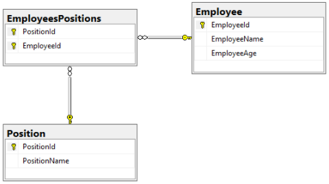
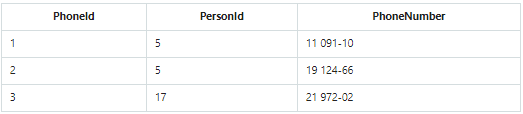

# Связи между таблицами базы данных

Реляционные базы данных содержат таблицы, которые связаны между собой.

Связи создаются с помощью внешних ключей (FOREIGN KEY).

## PRIMARY KEY / FOREIGN KEY

Первичный ключ **PRIMARY KEY** – это строка c id, имеет уникальное значение, не должна меняться со временем, не может содержать NULL.  
За уникальное значение первичного ключа отвечает атрибут AUTOINCREMENT.

Внешний ключ [**FOREIGN KEY**](https://ru.wikipedia.org/wiki/%D0%92%D0%BD%D0%B5%D1%88%D0%BD%D0%B8%D0%B9_%D0%BA%D0%BB%D1%8E%D1%87) – это ключ, который ссылается на PRIMARY KEY другой таблицы и используется для связи двух таблиц.  

## Типы связей между таблицами

- Многие ко многим 
- Один ко многим:
	- с обязательной связью
	- с необязательной связью
- Один к одному:
	- с обязательной связью
	- с необязательной связью

## Многие ко многим

Связь "Многие ко многим" рассмотрим на примере - нужно написать БД, которая хранит работников компании и занимаемые ими должности. При этом:
- один работник может занимать несколько должностей
- одна должность может быть занимаема несколькими работниками

Для этого создадим 2 таблицы:
- работников представляет таблица «Employee» (id, имя)
- должности представляет таблица «Position» (id, название должности)

Теперь нам нужно установить между ними связь 'многие ко многим'. Для этого нам нужна таблица-посредник «EmployeesPositions», которая связывает между собой работника и должность:

  

  

*Как читать диаграмму выше*:   
- ключик - обозначает «один»
- знак бесконечности - обозначает «многие»

ИТОГ: для реализации связи 'многие ко многим' необходима таблица-посредник между двумя таблицами. Она должна хранить два внешних ключа, первый из которых ссылается на первую таблицу, а второй — на вторую.

## Один ко многим

Связь "Один ко многим" рассмотрим на примере - нужно написать БД, которая хранит пользователей и их номера телефонов. При этом:
- один пользователь может иметь несколько телефонов
- один телефон не может принадлежать нескольким пользователям

Для этого создадим 2 таблицы:
- пользователей представляет таблица «Person» (id, имя)
- номера телефонов представляет таблица «Phone»    
	 

В данном случаи таблица-посредник не нужна.

## Один к одному

Связь "Один к одному" рассмотрим на примере - есть таблица работников «Employee» (id, имя) в которой хранится 1000 записей. Перед нами поставили задачу - добавить в БД данные о том, является ли работник инвалидом или нет. Первое, что приходит в голову — это добавить новый столбец типа bool в таблицу. Но это слишком долго вписывать 1000 значений и ведь true вы будете вписывать намного реже, чем false (2% будут true, например).   
Более простым решением будет создать новую таблицу «DisabledEmployee», указав, что столбец EmployeeId может хранить только уникальные значения:    
 

ИТОГ: отношение 'один к одному' — это разделение одной и той же таблицы на две.

## Связи можно поделить на обязательные и необязательные

**Один к одному**:      
- с обязательной связью (у каждого человека есть паспорт и он только один)
- с необязательной связью (у каждого человека может быть заграничный паспорт и если да, то только один)

**один ко многим**:       
- с обязательной связью (у каждого гражданина есть несколько документов, подтверждающих его личность)
- с необязательной связью (у каждого человека могут быть дети)

**Многие к одному**:        
- с обязательной связью (у детей есть биологическая мать)
- с необязательной связью (у детей может быть мать и если да, то только одна, иначе сирота)

**Многие ко многим**:     
- любая связь многие ко многим является необязательной (женщины и мужчины могут быть любовниками причем не только относительно одного человека, а могут и не быть)
