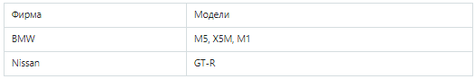
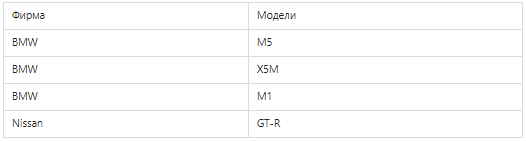
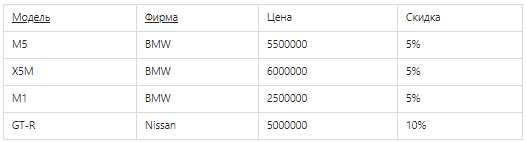
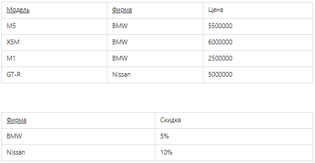
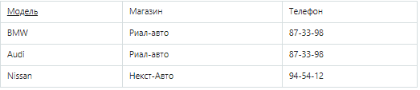
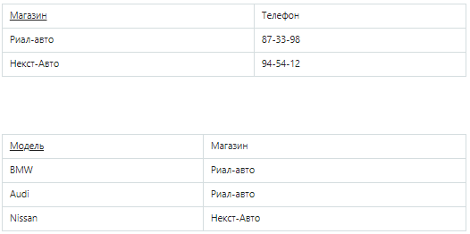

# Нормальная форма

**Нормализация** — это процесс организации данных в базе данных. Это включает создание таблиц и установление связей между этими таблицами в соответствии с правилами, предназначенными как для защиты данных, так и для того, чтобы сделать базу данных более гибкой за счет устранения избыточности и непоследовательной зависимости.

Существует несколько правил нормализации базы данных. Каждое правило называется "нормальной формой". 

**Нормальная форма** — требование, предъявляемое к структуре таблиц реляционных баз данных для устранения из базы избыточных функциональных зависимостей между полями таблиц.

## Первая нормальная форма

Первая нормальная форма предполагает, что:
- В таблице не должно быть дублирующих строк
- В столбце хранятся данные одного типа
- Отсутствуют массивы и списки в любом виде

ПЛОХО:   
 

ХОРОШО:     
 

## Вторая нормальная форма

Ключ — это столбец или набор столбцов (составной ключ) для уникальной идентификации записи в таблице.

Вторая нормальная форма предполагает, что:
- Таблица должна находиться в первой нормальной форме
- Таблица должна иметь ключ
- Все неключевые столбцы таблицы должны зависеть от полного ключа (в случае если он составной). 
	Иными словами, в таблице не должно быть данных, которые можно получить, зная только половину ключа, т.е. только один столбец из составного ключа.

ПЛОХО:   
 

Цена машины зависит от модели и фирмы. Скидка зависит от фирмы, то есть зависимость от первичного ключа неполная. Исправляется это путем декомпозиции на два отношения.

ХОРОШО:          
  

## Третья нормальная форма

Третья нормальная форма предполагает, что:
- Таблица должна находиться в первой и второй нормальных формах
- В таблице должна отсутствовать транзитивная зависимость (это когда неключевые столбцы зависят от значений других неключевых столбцов)

ПЛОХО:     
 

Таблица находится во 2НФ, но не в 3НФ.     
«Модель» является первичным ключом, но личных телефонов у автомобилей нет, и телефон зависит исключительно от магазина.       
Таким образом, в отношении существуют следующие функциональные зависимости: 
- Модель → Магазин
- Магазин → Телефон
- Модель → Телефон  

Зависимость Модель → Телефон является транзитивной, следовательно, отношение не находится в 3НФ.
В результате разделения исходного отношения получаются два отношения, находящиеся в 3НФ:

ХОРОШО:           
 